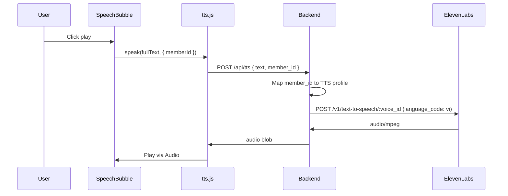

# Kế hoạch: Chuyển TTS từ Web Speech API sang ElevenLabs (âm thanh tiếng Việt)

## Hiện trạng

- **TTS hiện tại:** [frontend/src/utils/tts.js](frontend/src/utils/tts.js) dùng `speechSynthesis` / `SpeechSynthesisUtterance` (Web Speech API), không có mapping theo từng triết gia.
- **Nơi gọi:** [frontend/src/components/SpeechBubble.jsx](frontend/src/components/SpeechBubble.jsx) gọi `speak(fullText, { rate, pitch })` theo `member.role` (chairman vs philosopher).
- **Layout:** [frontend/src/config/councilLayout.js](frontend/src/config/councilLayout.js) có 4 council members (plato, descartes, nietzsche, confucius) và chairman (lenin) — khớp 1:1 với 5 profile trong [backend/TTS_profile.md](backend/TTS_profile.md).

## Kiến trúc đề xuất

- API key **chỉ dùng ở backend** (biến môi trường `ELEVENLABS_API_KEY`), frontend không cần key.

## 1. Backend

### 1.1 Cấu hình và profile TTS

- **Env:** Đọc `ELEVENLABS_API_KEY` từ `.env` (hoặc `config.py`), báo lỗi rõ ràng nếu thiếu khi gọi TTS.
- **Profile:** Tạo cấu hình Python (trong `config.py` hoặc module mới `tts_config.py`) map `member_id` → tham số ElevenLabs lấy từ [backend/TTS_profile.md](backend/TTS_profile.md):
  - `lenin` → stability 0.8, similarity_boost 0.9, style 0.6, speed 1.1
  - `plato` → 0.5, (default), 0.2, 0.85
  - `descartes` → 0.9, 0.75, (default), 1.0
  - `nietzsche` → 0.3, (default), 0.8, 1.15
  - `confucius` → 0.7, (default), 0.1, 0.9
- **Voice ID:** ElevenLabs cần `voice_id` cho mỗi request. TTS_profile.md mô tả tính cách, không có `voice_id`. Sử dụng ELEVENLABS_VOICE_ID là 1 list chứa 5 strings tương ứng với 5 triết gia bắt đầu từ Lenin, Plato,...,Khổng Tử.  có thể mở rộng config map `member_id` → `voice_id`.

### 1.2 Endpoint TTS

- **Route:** `POST /api/tts`
- **Body:** `{ "text": string, "member_id": string }` (member_id: `lenin` | `plato` | `descartes` | `nietzsche` | `confucius`).
- **Logic:**
  - Validate `text` (không rỗng, giới hạn độ dài hợp lý).
  - Map `member_id` → profile (stability, similarity_boost, style, speed); nếu không có profile thì dùng default.
  - Gọi ElevenLabs `POST https://api.elevenlabs.io/v1/text-to-speech/{voice_id}`:
    - Header: `xi-api-key: ELEVENLABS_API_KEY`, `Content-Type: application/json`.
    - Body: `text`, `model_id: "eleven_multilingual_v2"` (hoặc `eleven_turbo_v2_5` nếu muốn latency thấp), `**language_code: "vi"**` để output tiếng Việt, `voice_settings`: { stability, similarity_boost, style, use_speaker_boost } (và speed nếu API hỗ trợ trong request body).
  - Trả về: binary audio (e.g. `audio/mpeg`) hoặc stream cùng content-type.
- **Lỗi:** 401/403/429 từ ElevenLabs → trả mã phù hợp và message (không lộ key); thiếu key → 503 hoặc 500 với message “TTS not configured”.

## 2. Frontend

### 2.1 API client

- Trong [frontend/src/api.js](frontend/src/api.js) (hoặc file riêng cho TTS): thêm hàm `requestTts(text, memberId)`:
  - `POST /api/tts` với body `{ text, member_id: memberId }`.
  - Response là blob (audio). Return `response.blob()` hoặc `response.url` (object URL) để phát.

### 2.2 Thay thế Web Speech trong tts.js

- [frontend/src/utils/tts.js](frontend/src/utils/tts.js):
  - **Bỏ** mọi dùng `speechSynthesis` / `SpeechSynthesisUtterance` / `getVoices()`.
  - **Giữ** `isTtsSupported()`: trả về `true` nếu backend có (hoặc luôn true khi có mạng; có thể thêm ping `/api/tts` health nếu cần).
  - `**speak(text, options)`:** nhận `options.memberId` (bắt buộc cho ElevenLabs). Gọi `requestTts(text, options.memberId)` → nhận blob → tạo `Audio()` (hoặc `new Audio(objectURL)`), gán `src`, gọi `.play()`, lưu reference để có thể `pause()`/stop khi gọi `stopSpeaking()`.
  - `**stopSpeaking()`:** dừng phát audio hiện tại (pause + clear src), giải phóng object URL nếu dùng.
  - Xử lý lỗi (network, 4xx/5xx): log và có thể gọi callback/event để UI báo “Không thể phát TTS”.

### 2.3 SpeechBubble

- [frontend/src/components/SpeechBubble.jsx](frontend/src/components/SpeechBubble.jsx):
  - Khi gọi TTS, truyền `member.id` (đã có từ `member`) vào `speak(fullText, { memberId: member.id })`.
  - Không còn dùng `rate`/`pitch` từ Web Speech; tốc độ/giọng do backend profile quyết định.

## 3. Output tiếng Việt

- Trong request gửi ElevenLabs luôn đặt `**language_code: "vi"**` (ISO 639-1).
- Dùng model hỗ trợ tiếng Việt: `**eleven_multilingual_v2**` hoặc `**eleven_turbo_v2_5**` (nếu có).
- Text từ council có thể là tiếng Anh; ElevenLabs sẽ đọc theo giọng và có thể phát âm theo ngôn ngữ. Để đảm bảo đọc đúng tiếng Việt, nếu nội dung là tiếng Anh có thể giữ nguyên (model đa ngôn ngữ vẫn đọc được) hoặc sau này bổ sung bước dịch text → tiếng Việt rồi mới gửi TTS (ngoài phạm vi bước này).

## 4. Tóm tắt file thay đổi

| Vị trí   | Thay đổi                                                                                                    |
| -------- | ----------------------------------------------------------------------------------------------------------- |
| Backend  | Thêm đọc `ELEVENLABS_API_KEY` (và tùy chọn `ELEVENLABS_VOICE_ID`), map TTS profile theo member_id.          |
| Backend  | Module gọi ElevenLabs (httpx/aiohttp) + endpoint `POST /api/tts`.                                           |
| Frontend | `api.js` hoặc tts API: `requestTts(text, memberId)` trả blob/object URL.                                    |
| Frontend | `tts.js`: bỏ Web Speech; `speak(text, { memberId })` gọi backend và phát Audio; `stopSpeaking()` dừng phát. |
| Frontend | `SpeechBubble.jsx`: gọi `speak(fullText, { memberId: member.id })`.                                         |

## 5. Lưu ý

- **Voice ID:** Cần chọn một voice_id hỗ trợ tiếng Việt (từ ElevenLabs Voice Library hoặc tài khoản). Có thể hardcode một ID mặc định trong config và ghi trong README hoặc `.env` (ví dụ `ELEVENLABS_VOICE_ID=...`).
- **Giới hạn text:** Nên giới hạn độ dài (ví dụ 5000 ký tự) để tránh tốn quota và timeout.
- **.env:** Thêm vào `.env.example`: `ELEVENLABS_API_KEY=`, `ELEVENLABS_VOICE_ID=` (optional).

Sau khi triển khai, người dùng bật TTS trong Council Courtroom sẽ nghe âm thanh do ElevenLabs tạo, với giọng theo từng triết gia (profile) và output tiếng Việt khi dùng `language_code: "vi"`.